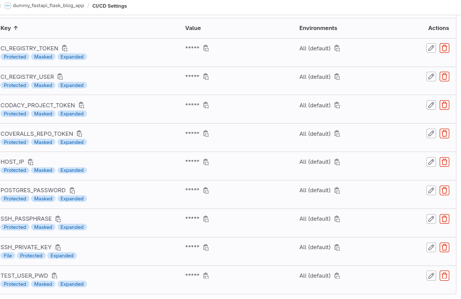

# DUMMY APP FOR LEARNING PURPOSES
**This is dummy blog application.**

Application is simultaneously served as a Flask and a FastAPI front-end. Postgresql the database and Nginx as reverse proxy.

Certbot and Nginx handle the HTTPS. A Vault adds sensitive datas into "the envrc" of the application.

Each of these services run on Docker.  

The FrontEnd is based on a startbootstrap's template (https://startbootstrap.com/).

Focus is more on technologies and how bind it for a project. This is the aim.

Do not pay much attention to the HTML-CSS-JS part.

Deployment is done on a small VirtualMachine so there may be a lack of performances.

**Look at GitHub issues to see what has to be done, what should be update.**

If the dummy example application is up you will find it at:

  FastAPI Front: https://dummy-ops.dev/docs

  Flask Front: https://dummy-ops.dev/front

**About Vault and sensitive datas**

The Vault here has a simple jwt authentication method. Idea is just to a avoid to have sensitive datas on Gitlab.

Purpose is that we do not want a project user, be able to echo the vars through the gitlab-ci.yml.

We put ourselves in the situation where "project users /developers" won't be able to connect to the virtual machine.

Consideration is that a sys-admin will be the only one which deploy the virtual machine through Terraform.

Also he should be the only one allowed to connect on the virtual machine.

None the less there are still sensitive datas in Gitlab ci-cd settings.

The SSH_PRIVATE_KEY is protected with a SSH passphrase. So the private key can be display in logs, but not the passphrase.

POSTGRES_PASSWORD in the Gitlab settings stands for the default Postgresql's Docker image password. This password is only used during unit_tests step.

By convenience, and because we do not want to use multiple virtual machines (droplets) the Vault is recreated at each new deployment into production.

So remember it's just a dummy project.

In this example the envrc file concatenates all the vars. Any sys-admin has access to all needed credentials used by the application.

**A default virtual machine with 1vcpu and 1gb RAM seems to be not enough. You can face a lack of performances (502 errors from Nginx, TimeoutError during ci-cd chain)**

  

  

## TECHNOLOGIES
Python 3.11 and later

Postgresql 15 (driver psycopg 3)

Gunicorn (for Flask)

Uvicorn (for FastAPI)

Nginx

Docker (docker-compose), DockerHub

Gitlab (the CI/CD chain is engaged throuh the Gitlab repo)

Terraform

Certbot

Vault

Lynis (for the virtual machine, droplet, hardening)

## HOW TO SET IT, HOW IT WORKS

  Notice: if you use VisualCode remember that you can preview the markdown from VisualCode by running: Ctrl+Shift+V

  There is no use of the create_app design pattern for Flask.

  The FastAPI app is the main one, and executes the database initialization at boot.

  Github Action workflows are used. If you want the GitGuardian check, you must set the secret.

  

### POSTGRESQL PREQUISITES FOR LOCAL USAGE
--------------------------
  - For a local usage (without docker) first be sure service is running (Linux example command):

        sudo systemctl start postgresql

  - Password must match the POSTGRES_PASSWORD defined in the .envrc.local file. So you may have to update it.

        [postgres@sanjurolab ~]$ psql
        psql (15.1)
        Type "help" for help.

        postgres=# \password postgres
        Enter new password for user "postgres":
        Enter it again:

### EXECUTION PREQUISITES
-------------------------
  You will need a SECRET_KEY var in able to run the application.

  To create one, either use python secrets module, or openssl:

    python -c "import secrets;print(secrets.token_hex())"

  or

    openssl rand -hex 32

  - For a single local usage (no reverse proxy).

    At the project root folder, touch (create) a ".envrc.local" file.

    Pay attention to this filename, required by "app/packages/settings.py" (line 6:DOTENV_NAME = ".envrc.local").

    The admin user is an application's admin. Not a Postgresql role. The engine use the default postgres user.

    The "dummy-operator" must match the one defined in the Gunicorn Dockerfile.

    Set something like this:

        SCOPE="local_test"
        POSTGRES_USER="postgres"
        POSTGRES_PASSWORD="postgres"
        POSTGRES_TEST_DB_NAME="test_dummy_blog"
        POSTGRES_PORT="5432"
        POSTGRES_HOST="0.0.0.0"
        ADMIN_LOGIN="admin"
        ADMIN_PASSWORD="applepie94"
        ADMIN_EMAIL="admin@localhost.fr"
        TEST_USER_PWD="aDummyPassword"
        SECRET_KEY="YourSUperSecretKey123oclock"
        FLASK_APP=project/__init__.py
        FLASK_DEBUG=1
        APP_FOLDER=/home/dummy-operator/flask
        EMAIL_SERVER="localhost"
        LOCAL_EMAIL_LOGS_FILE="/var/log/gunicorn/flask.logs"
        LOGGING_DEVEL="DEBUG"
        COVERALLS_REPO_TOKEN="yourCoverallsToken"
        BETTERSTACK_SOURCE_TOKEN="yourBetterstackToken"

  - For a local docker execution, you will have 4 services:

    Nginx (as reverse proxy), Uvicorn (for FastAPI), Gunicorn (for Flask) and Postgresql.

    At the project root folder, touch (create) an ".envrc.docker.local".

    Notice that this file is the one used for local deployment with local-docker-compose.yml.

    Set something like this (respect the scope):

        export SCOPE="local_test"
        export POSTGRES_USER="postgres"
        export POSTGRES_PASSWORD="yourPostgresDesiredPassword"
        export POSTGRES_TEST_DB_NAME="test_dummy_blog"
        export POSTGRES_PORT="5432"
        export POSTGRES_HOST="db"
        export ADMIN_LOGIN="admin"
        export ADMIN_PASSWORD="yourAdminDesiredPassword"
        export ADMIN_EMAIL="admin@localhost.fr"
        export TEST_USER_PWD="aDummyPassword"
        export SECRET_KEY="YourSUperSecretKey123oclock"
        export FLASK_APP=project/__init__.py
        export FLASK_DEBUG=1
        export APP_FOLDER=/home/dummy-operator/flask
        export EMAIL_SERVER="localhost"
        export LOCAL_EMAIL_LOGS_FILE="/var/log/gunicorn/flask.logs"
        export LOGGING_DEVEL="DEBUG"
        export COVERALLS_REPO_TOKEN="yourCoverallsToken"
        export BETTERSTACK_SOURCE_TOKEN="yourBetterstackToken"

### HOW RUN IT LOCALLY AS A SINGLE APPLICATION
----------------------------------------------

1. Clone the repository

    `git clone https://github.com/memphis-tools/dummy_fastapi_flask_blog_app.git`

    `cd dummy_fastapi_flask_blog_app`

2. Setup a virtualenv

      python -m venv env

      source env/bin/activate

      pip install -U pip

      pip install -r app/requirements.txt

      pip install -r app/flask_app/requirements.txt

3. Run the application

      python app/main.py

  - Swagger docs will then be served at:

        http://localhost:8000/docs

  - If you need to run Flask locally without docker, you can not right now.

    Either update app/main.py or set yourself a multi-process (Gunicorn and Uvicorn).

    Notice that pytest will import the Flask app (see fixtures at app/tests/conftest.py). So we test FastAPI routes and Flask also.

### HOW RUN IT LOCALLY AS A DOCKER APPLICATION
----------------------------------------------
You do not need to create a python virtualenv.

  - Example (for Linux):

      docker-compose --env-file ./.envrc.docker.local -f local-docker-compose.yml up -d --build

      docker-compose ps

      docker ps -a --format 'Image: "{{ .Names }} \nPorts: "{{ .Ports }}"\nStatus: {{ .Status }}\n'

      docker-compose -f local-docker-compose.yml down

  - Swagger docs will then be served at:
        http://localhost/docs

    As we run locally, there is a default test database set with some dummies data (see app/packages/utils.py).

    You will be able to login with following (example) credentials: donald / applepie94.

    You can set some default variables in "app/packages/settings.py".

  - Flask front-end will be reachable at:

        http://localhost/front/

### HOW TEST IT
---------------
  Notice we set a pytest.ini file to define our patterns.

  Tests occure when you run locally without docker, or during the ci-cd execution.

  Avoid to change tests order (particulary about the session cookie in tests_flask_urls).

  To run test for a local execution (ensure postgresql service is started):

      source venv/bin/activate

      python -m coverage run -m pytest -vs

      python -m coverage report

  80 is a minimum relevent score.

  To run test during the gilab-ci execution, see .gitlab-ci.yml file.

  You must also pay attention to the following Gitlab's CI/CD settings variables.
  During gitlab-ci tests, the official postgresql image is used.

      POSTGRES_HOST: postgres
      POSTGRES_PASSWORD: postgres
      POSTGRES_PORT: 5432
      POSTGRES_USER: postgres
      POSTGRES_DB: test_dummy_blog

### HOW CHECK PEP'S RECOMMENDED SYNTAX

      python -m flake8 --format html --htmldir flake8_html_report/

  You can use black to format code

      black app/packages/

      black app/tests/

### HOW CHECK LINT SCORE

    pylint app/

### HOW RUN IT IN PRODUCTION
----------------------------

  - You must have a virtual machine. Here we used [DigitalOcean](https://www.digitalocean.com/) cloud provider.

    We use HashiCorp Terraform tool to generate the virtual machine (the "droplet") on DigitalOcean.

    [Install Hashicorp's terraform](https://developer.hashicorp.com/terraform/tutorials/aws-get-started/install-cli)

    Notice and adapt the [VirtualMachine /Droplet's definition](https://github.com/memphis-tools/dummy_fastapi_flask_blog_app/tree/development/terraform/debian_with_docker.tf) file.

    These variables are used to create the virtual machine ("droplet"), and to setup the Vault.

    Notice the "terraform/digitalocean_firewall.tf" file which set the desired rules (8200 is for the Vault).

    You must have a DigitalOcean account, then created a personal access token, and a ssh dedicated key-pair.

    In the following sequence you can change directory into the terraform dir (cd terraform) to avoid the "-chdir" usage.

      Copy the variables file and set the ones you need:

      `cp terraform/variables.tf.ORI terraform/variables.tf`

      Export your DigitalOcean personal access token:

      `export DO_PAT="dop_v1_2WhatADopSecretIsNotItAsLongItIs"`

      Initialize terraform:

      `terraform -chdir=terraform init`

      Create terraform plan:

      `terraform -chdir=terraform plan -var "do_token=${DO_PAT}" -var "pvt_key=[path to your private key]"`

      Execute the plan,

      `terraform -chdir=terraform apply -var "do_token=${DO_PAT}" -var "pvt_key=[path to your private key]" -auto-approve`

      Watch out the end of execution and because it succeeded, consult the following.

      `terraform -chdir=terraform state list`

      `terraform -chdir=terraform state show digitalocean_droplet.dummy-django-with-docker`

      Notice the public ipv4_address. Source your ssh private key and login through ssh.

      `ssh dummy-user@PublicIpAddress`

      If you need to destroy the droplet:

      `terraform -chdir=terraform plan -destroy -out=terraform.tfplan \
          -var "do_token=${DO_PAT}" \
          -var "pvt_key=/home/sanjuro/.ssh/terraform/id_rsa"
      `

      `terraform -chdir=terraform apply terraform.tfplan`

  - Only a push to the master branch will trigger the deploy step of the gitlab-ci.yml file

  - Do not remove the "dummy_user_certbot-etc" volume because certbot will store the https cert in it.

  - For the production docker execution, you will have 5 services:

    Nginx (as reverse proxy), Uvicorn (for FastAPI), Gunicorn (for Flask), Postgresql, and certbot.

    As we use the gitlab-ci we have to set these settings in the Gitlab project.

    Remember to add a blank line at the end of SSH_PRIVATE_KEY declaration.

    

    See logs on Betterstack.

    

### HOW DEBUG IT IN PRODUCTION
------------------------------
If you need to debug from the virtual machine, at the project root folder:

  - touch (create) an "envrc" and source it.

    ADMIN_EMAIL is used by certbot. It's also used to create an application admin account in database.

    POSTGRES_HOST is the name of docker-compose service.

        export GIT_COMMIT="theLatestSHACommit"
        export SCOPE="production"
        export POSTGRES_USER="postgres"
        export POSTGRES_PASSWORD="yourPostgresDesiredPassword"
        export POSTGRES_PRODUCTION_DB_NAME="dummy_blog"
        export POSTGRES_PORT="5432"
        export POSTGRES_HOST="db"
        export ADMIN_LOGIN="admin"
        export ADMIN_PASSWORD="yourAdminDesiredPassword"
        export ADMIN_EMAIL="admin@localhost.fr"
        export TEST_USER_PWD="aDummyPassword"
        export SECRET_KEY="YourSUperSecretKey123oclock"
        export FLASK_APP=project/__init__.py
        export FLASK_DEBUG=0
        export APP_FOLDER=/home/dummy-operator/flask
        export EMAIL_SERVER="localhost"
        export LOCAL_EMAIL_LOGS_FILE="/var/log/gunicorn/flask.logs"
        export LOGGING_DEVEL="DEBUG"
        export COVERALLS_REPO_TOKEN="yourCoverallsToken"
        export BETTERSTACK_SOURCE_TOKEN="yourBetterstackToken"

  - run the docker-compose like this (you have to build if you have not download images):

      docker-compose -f deploy_init-certbot-docker-compose.yml up -d  --build

      docker-compose -f deploy_init-certbot-docker-compose.yml down

      docker-compose --env-file ./.envrc.docker -f docker-compose.yml up -d --build

### HARDENING

  You should use the "lynis" tool on the virtual machine and run "lynis audit system".

  80 is a minimum relevent score.

### USEFULL LINKS
-----------------
To run Flask behind Gunicorn and Nginx i used the following link:

https://testdriven.io/blog/dockerizing-flask-with-postgres-gunicorn-and-nginx/

For Flask i used:

https://www.udemy.com/course/100-days-of-code/

For Flask image upload i used:

https://flask-wtf.readthedocs.io/en/0.15.x/form/

https://flask.palletsprojects.com/en/2.3.x/config/

https://flask-resize.readthedocs.io/index.html

For Flask template custom filters i used:

https://stackoverflow.com/questions/4830535/how-do-i-format-a-date-in-jinja2

For FastAPI, the ci-cd i used:

https://fastapi.tiangolo.com/tutorial/security/

https://pypi.org/project/pytest-postgresql/

https://gitlab.com/gitlab-examples/postgres/-/blob/master/.gitlab-ci.yml?ref_type=heads

https://medium.com/metro-platform/continuous-integration-for-python-3-in-gitlab-e1b4446be76b

To avoid log warning "AttributeError: module 'bcrypt' has no attribute '__about__'" i followed theses links:

https://github.com/pyca/bcrypt/issues/684

https://www.geeksforgeeks.org/hashing-passwords-in-python-with-bcrypt/

Because of "CVE-2024-23342 ecdsa may be vulnerable to the Minerva attack" we do not use python-jose:

https://github.com/mpdavis/python-jose/blob/master/jose/jwt.py

See how we implement the FastAPI security principles in app/packages/fastapi/routes/routes_and_authentication.py

To use the Hashicorp Vault, and learn how to use it:

https://hub.docker.com/r/hashicorp/vault

https://testdriven.io/blog/dynamic-secret-generation-with-vault-and-flask/

https://testdriven.io/blog/managing-secrets-with-vault-and-consul/

https://developer.hashicorp.com/vault/tutorials/auto-unseal/autounseal-transit

https://docs.gitlab.com/ee/integration/vault.html

https://developer.hashicorp.com/vault/docs/auth/jwt#redirect-uris

https://developer.hashicorp.com/vault/tutorials/auth-methods/approle

https://support.hashicorp.com/hc/en-us/articles/12406076771347-Vault-JWT-auth-with-static-keys

To understand Terraform templates usage i used:

https://spacelift.io/blog/terraform-templates

To set the DigitalOcean Firewall through Terraform i used:

https://www.digitalocean.com/community/tutorials/how-to-import-existing-digitalocean-assets-into-terraform

https://registry.terraform.io/providers/digitalocean/digitalocean/latest/docs/resources/firewall

For the logo and favicon.ico i used:

https://www.canva.com

About predefined variables for gitlab-ci:

https://docs.gitlab.com/ee/ci/variables/

For the Docker-Hub registry credentials:

https://docs.gitlab.com/ee/user/packages/container_registry/authenticate_with_container_registry.html
